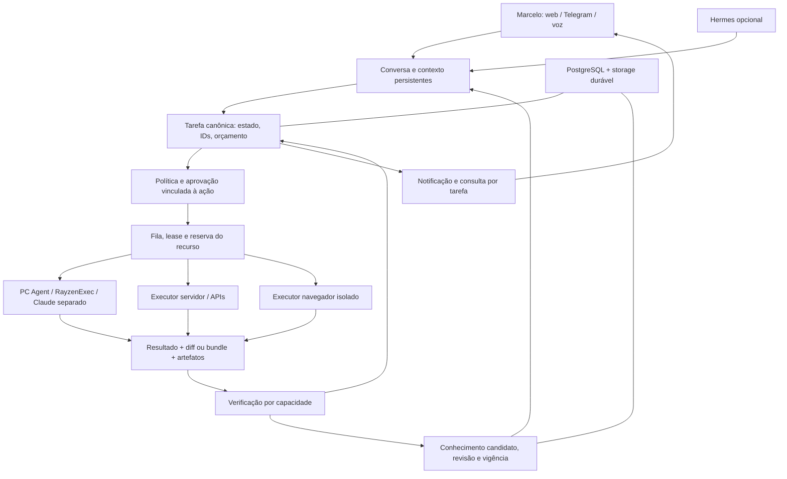

# Plano de evolução — do contexto útil à delegação confiável

Base: [auditoria](AUDITORIA.md) do HEAD `8293ab760287bb1670dfa20f7f7eb5ed1aad4856`. **Este documento é proposta; nenhuma etapa foi implementada pela auditoria.**

## 1. Arquitetura recomendada

Manter Rayzen como autoridade persistente sobre pessoa/projeto, tarefa, autorização, resultado e conhecimento. Consolidar os caminhos V1/V2 gradualmente, por comportamento, sem trocar simultaneamente banco, canais, fila e executor.

O núcleo do produto é um contrato durável de trabalho. Web, Telegram, Claude, PC Agent e eventualmente Hermes participam desse contrato. A conversa deve aceitar uma tarefa e devolver sua identidade rapidamente; o executor trabalha em background; outro canal consulta/responde à mesma tarefa. O modelo propõe ações, a política autoriza, o executor entrega e o verificador comprova.

O diagrama é destino arquitetural, não retrato da integração atual. Reusar PostgreSQL, Redis/Bull, Evidence e entidades existentes. Decidir se Mission/Step hospedará a tarefa principal durante a etapa 0, após mapear migração de estados; não criar uma terceira fila de domínio para contornar duas anteriores.

### Responsabilidades e contratos mínimos propostos

| Contrato | Informação obrigatória | Garantia |
|---|---|---|
| Contexto | pessoa/escopo, projectId quando aplicável, conversationId, fontes, versões e falhas de consulta | Documento recuperado é referência; não concede autorização |
| Tarefa | taskId, correlationId, projectId/namespace, ator, intenção, critério de aceite, recurso/baseRevision, idempotencyKey | Aceitação recuperável e mesma identidade em todos os canais |
| Execução | attemptId, executorId/capabilities, leaseUntil, heartbeat, workspace, deadline, cancelRequested | Uma reserva por recurso; retries por política e reconciliação |
| Aprovação | approvalId, taskId, revisão do plano, hash dos argumentos/recurso, principal autenticado, expiresAt, consumidaEm | Silêncio não autoriza; resposta não é transferível para outra ação |
| Resultado | estado técnico, exitCode/erro de domínio, artefatos, commit/base, testes e duração | Promise/HTTP 200 não equivalem a sucesso funcional |
| Verificação | acceptanceId, método, resultado passed/failed/not_run, TestRun, evidência e verificador | Sem evidência exigida não existe verified |
| Memória | sourceRef, escopo, tipo, confirmed/inferred/observed, validFrom, supersedes, status de revisão | Correção escolhe versão vigente e invalida contexto/cache |
| Custo | tarefa, tentativa, provedor/modelo efetivo, tokens/custo ou indisponível, reserva/teto | Falta de medição não é custo zero |

Nomes de campos são proposta, sujeitos ao schema já existente. Não é necessário um barramento novo: outbox no Postgres e publicação idempotente sobre o Redis existente podem fechar a janela “salvou tarefa, não enfileirou”. Antes de adotar isso, comparar com o custo de usar corretamente o ciclo de worker Bull para o executor remoto; evitar status concorrentes independentes.

Estados mínimos: accepted → queued → running ↔ waiting_for_input/approval → completed_unverified → verified ou failed; cancelled/expired/recovery_required são resultados explícitos. Registrar transitions com versão/compare-and-set. Reinício não converte automaticamente execução de efeito desconhecido em nova tentativa.

## 2. Caminhos viáveis

| Caminho | Ganho | Limitação concreta / custo | Decisão |
|---|---|---|---|
| Fortalecer runtime atual | Reaproveita estado, canal Telegram, projetos, memória, gates, agentes e evidências já usados | Exige reparar contratos, duplicidade V1/V2 e lifecycle da fila | **Recomendado para etapas 0 e 1** |
| Hermes como adapter de diálogo/runtime | Pode oferecer sessão/histórico e interação multicanal; usa modelos e MCP existentes | Spike local parado, estado incompletamente persistido, memória adicional e bridge de IDs/aprovações ainda necessários | Experimento comparativo após núcleo passar E01–E07 |
| Hermes como controlador de tudo | Poderia reduzir código próprio de diálogo | Não elimina bugs do executor Rayzen, falso sucesso, cleanup ou dados existentes; exige migração e reconciliação de duas autoridades | Não justificado pelo diagnóstico atual |
| Reescrever ou adotar novo framework | Só justificável por requisito não atendível com custo aceitável | Nenhuma limitação estrutural de Nest/Postgres/Redis demonstrada; risco de reconstruir integrações | Não recomendado |

A documentação oficial do Hermes descreve histórico persistido em SQLite e retomada de sessão. Isso é uma capacidade upstream a ensaiar, não integração já entregue no Rayzen. O Compose local persiste somente memories; antes de avaliar retomada, incluir o estado efetivamente usado pelo perfil/gateway escolhido. [Sessões Hermes](https://hermes-agent.nousresearch.com/docs/user-guide/sessions), [armazenamento de sessões](https://hermes-agent.nousresearch.com/docs/developer-guide/session-storage).

No experimento futuro, Rayzen continua fonte canônica de fatos de projeto e autorização. Memória pessoal Hermes deve ter namespace e regras claras; não sincronizar automaticamente resumos dos dois lados, pois isso pode converter repetição em evidência falsa. Usar token por consumidor e testar efeitos internos de consultas readonly.

Critério para adotar Hermes: executar os mesmos cenários, medir falhas, latência, consumo, recuperação e manutenção; demonstrar ganho em diálogo/continuidade sem perder IDs, governança ou possibilidade de retirar o adapter. Não contar ferramentas listadas como capacidade validada.

## 3. Etapa 0 — remover os bloqueios de confiança

**Objetivo:** um fluxo de execução não pode perder trabalho, inferir autorização, esconder falha ou abandonar estado silenciosamente.

| Tipo | Trabalho | Dependências / esforço relativo | Risco | Conclusão objetiva |
|---|---|---|---|---|
| Corrigir | Cleanup preserva alterações tracked/untracked antes de remover workspace; impedir fallback para árvore do dono quando isolamento é exigido | A01; pequeno/médio | Fixar só o caminho com commit deixa perda residual | E12 passa com WIP, erro, cancelamento e base divergente |
| Corrigir | Timeout e negação não aprovam; marcador obrigatório/result schema; pergunta sem resposta pausa | A02/A04; pequeno | Conectar fila antes permite efeito não autorizado | P5/P6 deixam de reproduzir; E05 sem ação adicional |
| Corrigir | Propagar falha de domínio e separar completed de verified; QA sem dados é not_run | A04/A11; pequeno/médio | Quebrar consumidor que esperava done genérico | E13 prova erro, teste falho, ausência e sucesso com estados corretos |
| Integrar | Unificar criação AgentSession com tarefa real, ação válida, path resolvido e receipt | A03; médio | Duplicar jobs se houver retry de requisição | Um pedido/retry gera mesma tarefa e executor correto |
| Corrigir/integrar | IDs atravessam V2→V1→agent→result; autorização vale em cada entrada | A08; médio | Gate V2 e aprovação V1 se contradizerem | Chamada direta não amplia autoridade; hash alterado/replay negados |
| Corrigir | Lease de job/recurso, recovery, cancelamento e limite por executor | A05; médio/grande | Repetir efeitos após queda | E06 com falha em cada transição, nenhum efeito duplicado |
| Corrigir | Pergunta/approval persistida por tarefa e identidade; Telegram usa referência explícita | A06; médio | Mensagem antiga consumir nova aprovação | E04 com duas tarefas e restart |
| Operar depois das correções | Build/versionamento do agent, inspeção ACL, boot V2 condicionado à migration, baseline de release | A12/A13; pequeno/médio | Confundir fonte atual com processo antigo | Versão de cada executor demonstrada; migration falha impede boot; credencial fora do escopo indevido |

Ordem recomendada: preservação e decisões de segurança → estados/contratos → despacho → recuperação/correlação → validação da implantação. A implementação deve ter seu próprio fluxo de revisão/deploy; esta auditoria não alterou ACL ou reiniciou processos.

**Esforço total relativo: grande**, composto de correções pequenas e uma integração central média/grande. Não estimar dias antes de escolher o caminho canônico e identificar consumidores que precisam de compatibilidade.

## 4. Etapa 1 — primeiro fluxo completo de uso diário

**Marco recomendado:** em um projeto de teste, Marcelo pede uma alteração pequena e reversível; recebe taskId e plano curto; continua conversando/trabalhando; executor separado faz a alteração; uma decisão necessária pode ser respondida no celular; o resultado volta como diff/bundle, testes e artefatos. Marcelo revisa a entrega; só resultado verificado alimenta conhecimento consolidado.

| Tipo | Reutilizar / entregar | Dependências | Esforço / risco | Critério |
|---|---|---|---|---|
| Reutilizar | Web, Telegram, Projects/ProjectState, ConversationMessage, Memory/ContextEngine, queue, Agent e RayzenExec | Etapa 0 | Médio; escolher subconjunto e reduzir caminhos | Um fluxo com todos os IDs e estados |
| Corrigir | Janela recente V1 e persistência/reidratação da conversa utilizada | A07/A09 | Médio; migração compatível | E01/E09 após restart e troca de canal |
| Integrar | Cartão de tarefa persistente, consulta de estado, resposta vinculada, progresso e finalização | Tarefa canônica | Médio; UI não pode inventar sucesso | Recebimento rápido, chat independente, pendência clara |
| Integrar | Entrega RayzenExec, checksum/base/commit e revisão | Workspace preservado | Médio; conflitos com trabalho local | Nenhuma mudança automática no checkout usado pelo Claude |
| Construir o elo ausente | Executor de navegador com Playwright e artefatos duráveis | Escolher URL de teste e navegador isolado; reusar dependência/testes existentes | Médio; não reaproveitar perfil pessoal sem necessidade | E03: assertion determina resultado, screenshot/trace vinculados a TestRun |
| Integrar | Evidência→TestRun já existente; depois modelo por caso se necessário | QA V1 + storage | Pequeno/médio | Não reconstruir autoassociação; corrigir vínculo determinístico por task/run |
| Validar | Jornada de aceitação com duas tarefas, timeout, restart e falha deliberada | Todas acima | Médio | E01–E07, E09, E12–E13 passam em staging |

**Critério de uso diário:** dez jornadas registradas no projeto piloto, incluindo sucesso, falha de teste, timeout sem resposta, cancelamento e interrupção do executor. Zero aprovação implícita, zero perda de WIP, zero falha marcada verified. Esse número é um lote de aceite proposto, não métrica já obtida nem prova estatística de confiabilidade geral.

Durante esse marco, não é necessário app móvel próprio, controle da sessão Claude existente, assistente doméstico ou framework novo. Telegram e web atendem o canal móvel quando a correlação estiver correta.

## 5. Etapa 2 — assistente profissional e de estudos

**Objetivo:** retomar trabalho e aprendizado por evidência, produzir documentos confiáveis e melhorar processos a partir de resultados reais.

| Tipo | Entrega | Dependências / esforço | Risco | Aceite |
|---|---|---|---|---|
| Reutilizar/integrar | Blueprint, Wiki, documentação, goals, memória por projeto e evidências | Marco diário; médio | Consolidar saída gerada como fato | Documento versionado com fontes e lacunas explícitas |
| Corrigir | Escrita canônica, supersessão e invalidação; namespace por projeto/pessoal/estudo | A09; médio/grande | Duplicar regras entre Brain/Memory/V2 | E07/E10 em todos os ingressos habilitados |
| Construir | Objetivos/conceitos, exercícios, tentativas, avaliação e agenda de revisão | Contexto study + memória; médio | Confundir exposição com domínio | E08 mede conhecimento demonstrado e retoma erro específico |
| Integrar | QA V1/execuções reais como sinais do Scientist, com classificação de erro de infra versus qualidade | Resultados verificados; médio | Otimizar sobre falso sucesso ou ruído | E11 usa falha conhecida, conjunto golden estável e regressões |
| Corrigir | Promoção applied separada de approved, efeito idempotente e rollback de estratégia | Gates + strategies; médio | Gate approved com efeito falho | Falha de promoção fica visível/reexecutável; retorno reproduz baseline |
| Integrar | Custo por tarefa/capacidade, modelo efetivo, quotas e orçamento | Instrumentação; médio | Alias mascarar fallback pago | E14; painéis distinguem medido, estimado e desconhecido |

Não expandir o laboratório evolutivo antes de haver sinais úteis. A promoção de prompt só deve ser divulgada como melhoria para os chamadores que realmente usam essa estratégia.

## 6. Etapa 3 — assistente pessoal persistente

**Objetivo:** continuidade entre dispositivos, responsabilidades pessoais explícitas e iniciativa relevante.

| Tipo | Entrega | Dependências / esforço | Risco | Aceite |
|---|---|---|---|---|
| Reutilizar | Identidade versionada, sessões, task ledger, Telegram/web, voice | Etapas anteriores | Baixo/médio | Mesma pessoa/contexto sem misturar clientes |
| Integrar | Agenda, documentos e serviços pessoais por API quando possível | Serviço escolhido, credenciais com escopo mínimo | Médio por integração; quota e permissão externa | Ler primeiro; escrita só com responsabilidade delegada e receipt |
| Construir | Rotinas/assinaturas de eventos, prioridades e horários de silêncio | Tarefas e notificações confiáveis | Médio; excesso de avisos | Avisos explicam evento, utilidade e ação; deduplicação e opt-out |
| Corrigir/integrar | Voz PT-BR e recuperação em texto | Teste real de áudio/provedor | Pequeno/médio | Falha de áudio não perde intenção nem estado |
| Validar opcionalmente | Hermes como adapter concorrente ao diálogo atual | Aceite comparativo seção 2 | Médio; duas memórias canônicas | Melhor experiência medida mantendo mesma autoridade Rayzen |
| Operar | Backup/restore completo e presença com PC indisponível | Manifesto de estado, RPO/RTO acordados | Médio | E15 e disponibilidade por capability explícita |

Sentinel só entra se os testes mostrarem uma lacuna local de supervisão que a tarefa de login e um supervisor simples não cubram. Primeiro definir o que ele recupera: processo, login, executor, versão ou tarefa. Não criar outro “agente” como substituto de uma lease ou registro de execução.

## 7. Etapa 4 — integrações domésticas futuras

Reutilizar tarefa, autorização, identidade, auditoria e conectores. Construir adapters específicos para dispositivos e feedback de estado. Começar com leitura e simuladores; depois uma ação reversível de baixo impacto em dispositivo escolhido.

Dependências: etapa pessoal estável, distinção entre intenção e comando físico, confirmação de estado posterior, limites de responsabilidade e operação local quando a internet falhar.

Esforço: médio por família de dispositivos; risco superior ao software por efeito físico. Critério E16: duas mensagens repetidas produzem um comando, indisponibilidade não vira sucesso, e o retorno do dispositivo confirma o estado. Fechaduras, segurança e outros efeitos sensíveis exigem decisão específica de Marcelo antes de implementação.

## 8. Decisões que dependem de Marcelo

Estas decisões orientam a implementação futura; não bloqueiam a conclusão da auditoria.

| Decisão | Recomendação inicial | Quando necessária |
|---|---|---|
| Projeto/tarefa piloto | Um projeto com teste determinístico e alteração pequena, em ambiente separado do trabalho corrente | Antes da etapa 1 |
| Responsabilidades delegadas | Começar com leitura, preparação de diff/bundle e testes; aprovação explícita para aplicação/publicação | Antes de habilitar ações por canal |
| Operação com PC desligado | Servidor mantém conversa/estado e executa só capabilities próprias; desktop aguarda presença | Ao definir disponibilidade diária |
| Dados pessoais e provedores | Separar clientes/pessoal; indicar quais dados podem sair para cada provedor e o que pode ser memorizado | Antes das integrações pessoais |
| Orçamento | Teto mensal e por tarefa, com fallback pago explicitamente incluído ou excluído | Antes de automação recorrente |
| Retenção e recuperação | Escolher o que deve poder ser apagado, backup fora do host e RPO/RTO aceitáveis | Antes de depender do sistema diariamente |

A escolha técnica de Hermes pode esperar o experimento. A primeira decisão de produto relevante é qual tarefa diária deve tornar-se confiável.

