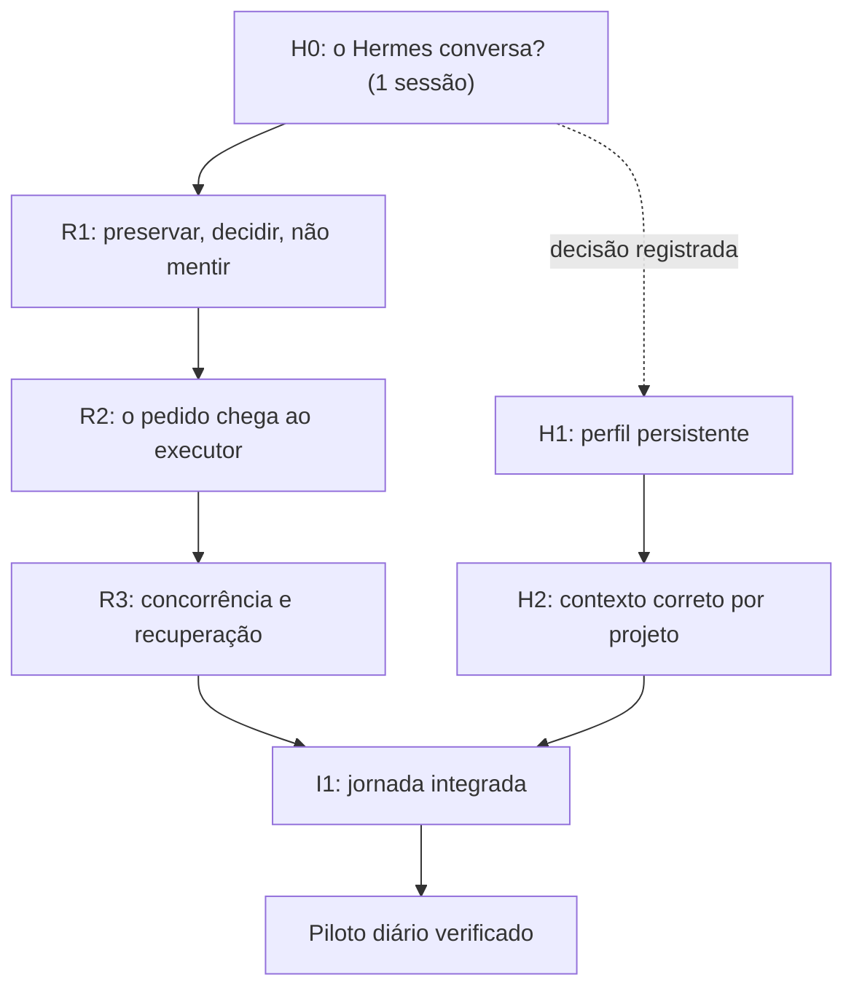

# Plano refinado — o caminho até o objetivo real

Versão 2.0 · 13/09/2026 · revisa o `PLANO-DE-TRABALHO.md` do pacote de continuidade com base na
medição de [B0-REVALIDACAO.md](B0-REVALIDACAO.md). **Proposta — nada implementado.**

O objetivo não mudou: *conversar com o Hermes, retomar um projeto, delegar uma alteração pequena,
receber entrega verificável, corrigir e revalidar.* O que muda é a ordem, o tamanho de cada bloco
e o que sai do horizonte.

---

## 1. Quatro correções ao plano do pacote

| # | O pacote diz | A medição diz | Efeito |
|---|---|---|---|
| 1 | R e H são frentes paralelas; H1 pode começar depois de B0 | O Hermes **nunca sustentou uma conversa** nesta casa: container parado, `sleep infinity`, sem token efetivo. Todo o valor do plano depende dele | **H0 antes de tudo.** ~1h para saber se a premissa se sustenta |
| 2 | R1 é um bloco com três critérios de aceite | São **três mudanças cirúrgicas em três arquivos**, e as reproduções (P5/P6/P7) já existem prontas na auditoria | R1 encolhe: o trabalho é virar reprodução em spec |
| 3 | A03 exige escolher o contrato de tarefa canônico entre entidades concorrentes | Não há concorrência: `AgentSession` já é a entidade, `TaskLog` tem **zero leitores**, e o `ACTION_ROLE` já conhece a ação. Falta **uma** peça | A03 vira extração de método + remoção de código morto |
| 4 | X0 inventaria conectores n8n/WhatsApp/agenda; X1 os implementa | **Não existe nenhum conector.** Zero linhas | X1 é produto novo com dependência externa — sai do primeiro marco por tamanho, não por prioridade |

### A tese do refinamento

O pacote protege bem contra um erro (*"não reduza o Hermes por antecipação"*) e deixa o simétrico
aberto: **construir R1–R3 inteiro apostando num componente que nunca rodou**. As duas apostas
custam o mesmo se erradas, mas só uma custa barato para verificar.

Consertar a sessão supervisionada é trabalho legítimo com ou sem Hermes — é o caminho de delegação
do próprio Rayzen. Mas *a ordem* entre H e R deve ser decidida por qual descoberta é mais cara de
chegar tarde, e essa é H.

---

## 2. Sequência proposta



H0 é novo. R1 pode começar em paralelo a H0 se houver duas janelas de trabalho — não depende dele.
O que **depende** de H0 é H1 em diante, e o quanto de I1 vale construir.

---

## 3. H0 — a pergunta que custa 1h e decide o plano · ✅ **APROVADO em 13/09**

> **Resultado registrado em [H0-RESULTADO.md](H0-RESULTADO.md).** O Hermes v0.21.2 chamou o MCP do
> Rayzen por decisão própria e devolveu dados reais e conferíveis. A premissa do plano se sustenta;
> a ordem `H0 → H1/H2 → I1` deixa de ser aposta. O que está abaixo fica como registro do
> procedimento e do pré-requisito descoberto — ambos executados.
>
> Ressalvas em [H0-RESULTADO §4](H0-RESULTADO.md#4-ressalvas--o-que-não-foi-provado-e-a-dívida-encontrada):
> H0 mediu **um turno**. Retomada, conversa longa e isolamento entre projetos continuam por provar.

**Pergunta:** o Hermes, com o MCP do Rayzen conectado, sustenta um turno de conversa em que
*decide sozinho* chamar uma ferramenta de contexto e usa a resposta? Ou é um cliente de chat que
repassa texto?

Não é "o container sobe". É `hermes doctor` limpo, uma conversa, e o log do `mcp-http` mostrando a
chamada nomeada como `hermes`.

### Pré-requisito descoberto na medição — bloqueia o passo 1

`MCP_TOKEN_HERMES` **nunca foi gerado**: a linha não existe no `.env` do servidor, o `mcp-http`
(já atualizado, recriado em 13/09) a recebe vazia e a descarta, e o consumidor `hermes` não existe
do lado do servidor. Ver [B0 §7](B0-REVALIDACAO.md#7-estado-do-hermes--o-que-muda-o-procedimento).

Não é ajuste técnico de rotina — é criar credencial e mudar configuração de produção. **Exige
autorização explícita do dono**, e arrasta um segundo recreate:

| passo 0 | o quê | por quê |
|---|---|---|
| 0.a | gerar o token (`openssl rand -hex 32`) e declarar `MCP_TOKEN_HERMES=` no `.env` do servidor | sem valor, o filtro `&& valor` de `rayzen-mcp-http.mjs:164` descarta o consumidor |
| 0.b | `docker compose up -d --force-recreate mcp-http` | o processo lê `process.env` na subida; sem recriar, o consumidor novo não é descoberto. Interrompe o MCP HTTP por alguns segundos — o conector `MCP_TOKEN_RAYZEN_AI` sente |

**Procedimento (depois do passo 0):**

| passo | comando / verificação | por quê |
|---|---|---|
| 1 | `ps aux \| grep rayzen-deploy.sh` sem resultado | o `flock` do deploy não protege contra `up` manual concorrente — já derrubou containers em 13/09. Reconferir a cada `up` |
| 2 | `docker compose -f infra/hermes/docker-compose.hermes.yml --env-file .env up -d --force-recreate --build` | **recreate, não start**: o container parado é de 08/09, anterior à Fase 8, e por isso não tem a variável |
| 3 | `hermes doctor` / `hermes config check` dentro do container | separa "processo de pé" de "modelo respondendo" |
| 4 | uma conversa: *"que projetos existem e em que estado está o Rayzen AI?"* | exige `rayzen_list_projects` + `rayzen_get_state` por decisão do modelo |
| 5 | log do `mcp-http`: a chamada aparece identificada como consumidor `hermes` | prova o caminho inteiro, não só a resposta bonita |

**Saídas possíveis, todas aceitáveis:**

| resultado | o que decide |
|---|---|
| conversa + ferramenta chamada por decisão do modelo | H1/H2 seguem como o pacote propõe |
| conversa, mas ferramenta só quando instruída explicitamente | Hermes é interface; o loop agêntico fica no Rayzen. Muda I1, não invalida |
| não sobe / não responde / `unauthorized` persistente | registrar versão, erro e reprodução. **Não substituir por decisão apressada** — mas R1–R3 passam a valer por si, sem apostar em I1 |

**Limite declarado:** `gpt-4o-mini-gemini` é grupo de free tier e já deu 429 nas medições de
06/09. Um 429 em H0 é indisponibilidade do provedor, **não** reprovação do Hermes — repetir com
outro grupo sondado pelo invariante `modelos_llm_respondem` antes de concluir qualquer coisa.

**Custo se pulado:** R1+R2+R3 completos, e só então descobrir que a camada que consumiria tudo isso
não existe.

---

## 4. R1 — preservar trabalho, decidir de verdade, não mentir sobre o resultado

Três defeitos, três arquivos, e as reproduções já escritas. **O trabalho é converter P5/P6/P7 em
specs do produto** (falham no HEAD atual, passam depois) — não redescobrir os defeitos.

### R1.a — A01: a limpeza não pode destruir trabalho

`apps/agent/src/exec/workspace-isolado.ts:75`

```
git worktree remove --force <dir>     →   verificar sujeira; se suja, NÃO remover
```

Sem `--force` o git já recusa remover worktree sujo — a trava existe e foi desligada. A mudança
mínima é conferir `git status --porcelain` no worktree antes, e devolver
`{ dirRemovido: false, motivo: 'alterações não commitadas' }` em vez de apagar.

**Não** commitar automaticamente para "preservar": o `PLANO-DE-TRABALHO` já alerta que isso inclui
arquivos indevidos, e esta casa tem o precedente do `AGENT_TOKEN` que entrou num commit de
bootstrap por conveniência parecida.

> **Tensão a registrar, não a esconder:** worktree sujo que nunca é removido vaza disco em
> `tmpdir()`. É o lado certo da troca — disco é recuperável, trabalho não —, e
> `instrucoesDeMerge()` já diz onde o checkout ficou. Se virar problema real, a saída é um comando
> de limpeza explícito, nunca o `--force` de volta.

**Spec:** `exec/__tests__/workspace-isolado.spec.ts` — caso novo, derivado do P7: worktree com
`tracked` alterado + `untracked` novo → `removerWorktree` preserva os dois e o diretório continua
existindo. Vermelho no HEAD atual (P7 mediu `uncommittedFilesRemain:false`).

### R1.b — A02: silêncio não aprova, e a resposta oferecida precisa ser reconhecida

`apps/agent/src/actions/supervised-session.ts:509-518`

Duas correções, e a segunda é o achado novo de [B0 §3](B0-REVALIDACAO.md#3-a02-é-pior-do-que-a-auditoria-registrou--achado-novo):

| defeito | correção mínima |
|---|---|
| `!reply` entra no ramo APROVOU | ausência de resposta encerra a etapa explicitamente, com o trabalho preservado e o branch nomeado. Nunca continua |
| `\b(aprovad\|continu\|rejeit\|corrig)\b` nunca casa (prefixo + `\b`), então as três opções oferecidas caem todas em "instrução modificada"; e `\bpode\b` casa dentro de `"não pode"` | extrair `classificarResposta(reply): 'aprovado' \| 'rejeitado' \| 'instrucao'` para arquivo próprio, testável, que **reconhece as opções literais e os índices `1`/`2`/`3`** que o Telegram numera, e trata negação antes de afirmação |

Os índices importam: `agent-session.service.ts:61` já numera as opções na mensagem. Número é
determinístico — mesma família da regra desta casa de nunca pedir ao LLM o que tem dono
determinístico.

**Spec:** `actions/__tests__/resposta-aprovacao.spec.ts` — tabela de entradas com as três opções
literais, os três índices, `"não pode"`, `"não aprovado"`, `""` e `null`. Vermelho hoje em pelo
menos cinco linhas.

### R1.c — A04: falha não vira sucesso, ruído não vira conclusão

Dois pontos independentes:

| onde | hoje | correção |
|---|---|---|
| `apps/agent/src/poller.ts:65` | `status:'done'` sempre que a promessa resolve | `result.ok === false` → `status:'failed'` com o erro de domínio. Comparação **estrita**: ação que não devolve `ok` continua `done`, senão 28 ações mudam de comportamento de graça |
| `supervised-session.ts:559-563` | saída sem marcador, >50 chars → `complete` com `ok:true` | sem marcador reconhecido é **erro explícito**: "a sessão terminou sem declarar conclusão". Tamanho de texto nunca foi evidência |

**Specs:** `__tests__/poller-falha-de-dominio.spec.ts` (derivado do P3) e um caso em
`supervised-session` (derivado do P6).

**Critério de saída de R1:** C01, C02, C03 passam; cada spec demonstrada vermelha antes do
conserto. Nenhum outro módulo tocado.

---

## 5. R2 — o pedido chega ao executor (e continua consultável)

Três mudanças, todas em código existente:

| # | mudança | arquivo |
|---|---|---|
| 1 | extrair `enqueue(action, payload): Promise<string>` das linhas 82–96; `dispatch()` vira `enqueue()` + `waitForResult()` | `apps/api/src/modules/execution/execution.service.ts` |
| 2 | `AgentSessionService.create` chama `enqueue('supervised_session', { sessionId, prompt, projectId })` e **para de gravar `taskLog`** | `apps/api/src/modules/agent-session/agent-session.service.ts:19-30` |
| 3 | o agent resolve o diretório por `projectId` via `resolverWorkdir()` — já existe, da Fase 3 — em vez de cair em `process.cwd()` | `apps/agent/src/exec/workdir.ts` (reuso) |

Nada de camada nova. A #1 é o que o pacote chama de *"separar aceitação rápida do trabalho
demorado"*, e é literalmente uma extração de método: `dispatch()` hoje sempre espera 30s, e sessão
supervisionada dura horas — chamá-lo direto trocaria "nunca chega" por "estoura o timeout com a
sessão rodando órfã".

A #3 fecha o *"workspace resolvido"* que o contrato mínimo do pacote pede, com o mecanismo que já
existe e já tem teste anti-drift.

**Consultabilidade:** vem de `GET /agent/session/:id`, que já existe. `AgentSession` é a referência
persistente — não é preciso inventar `taskId` exposto.

**`TaskLog`:** remover a escrita agora; **não** dropar a tabela na mesma rodada. As cinco linhas
`pending` desde junho são evidência histórica do defeito e custam nada. Drop é migration, e
migration entra em rodada própria.

**Critério de saída:** C04 — um pedido de sessão criado pelo produtor real alcança o executor
real num projeto fixture, com `module/action` e workspace corretos, e a sessão é consultável
depois.

> **Ordem inegociável:** R2 **depois** de R1. Ligar o despacho hoje ativa um caminho onde o
> silêncio aprova (R1.b) e a limpeza destrói (R1.a). É exatamente o que a auditoria diz em §1:
> *"corrigir apenas o primeiro elo ativaria um caminho com outros defeitos críticos"*.

---

## 6. R3, H1, H2, I1 — o que já está descrito e continua valendo

Os blocos R3 (concorrência, resposta correlacionada, recuperação), H1 (perfil Hermes persistente),
H2 (contexto por projeto) e I1 (jornada integrada) ficam como o `PLANO-DE-TRABALHO.md` do pacote
os descreve — esse documento ainda não foi copiado para o repositório. Duas notas do que foi
medido:

- **R3/A06** — o `setReplyHandler` global é chamado em `AgentSessionService.create` e sobrescrito a
  cada sessão nova; `TelegramSession` (chat+tópico→projeto) já existe e é a fundação da correção.
  Não reconstruir vínculo de canal.
- **H2** — as 9 ferramentas MCP do Hermes são **todas de leitura**
  (`infra/hermes/config.yaml:64-74`). Nenhuma cria tarefa. Conectar o Hermes à delegação exige
  ferramenta nova **e** escopo novo no token: é mudança de fronteira de segurança, decidida depois
  de H0 e I1, nunca como ajuste de configuração.

---

## 7. Critérios: 20 viram 6 para o primeiro marco

O catálogo C01–C20 do pacote é bom como catálogo. Como plano, 20 critérios antes do primeiro uso
diário é o mesmo erro de construir vigilância antes de medir o produto.

| marco | critérios | por quê |
|---|---|---|
| **R1 pronto** | C01, C02, C03 | preservação, decisão, verdade do resultado |
| **R2 pronto** | C04 | o pedido chega e é consultável |
| **Hermes dialoga** | C08, C09 | perfil persiste; contexto certo, sem misturar projetos |
| **primeiro marco** | os seis acima | conversar, delegar uma alteração pequena, receber entrega verificável |

C05–C07 (concorrência, recuperação) entram com R3, antes de depender disso diariamente.
C15–C17 (n8n/WhatsApp/agenda) não têm sobre o que rodar hoje — ver §8.
C18/C19 (orçamento, restauração) precedem dependência operacional ampla, como o pacote já diz.

---

## 8. Fora do primeiro marco, com motivo

| item | motivo |
|---|---|
| n8n, agenda de cliente, CRM (X1, C15/C17) | **zero código existente** no Rayzen; exige instância n8n e agenda de servidor que não estão em lugar nenhum do inventário |
| WhatsApp (C16) | fora do primeiro marco, mas **o caminho mudou**: o Hermes tem `whatsapp` e `whatsapp-cloud` nativos ([H0 §5](H0-RESULTADO.md#5-achado-que-muda-o-planejamento-o-hermes-traz-canais-e-capacidades-próprias)). Investigar a integração nativa antes de construir conector no Rayzen. Continua exigindo conta WhatsApp Business e número verificado, que não existem |
| Voz PT-BR | `tts-1` quebrado desde 17/08 sem substituto testado; candidatos Gemini nunca exercitados com áudio |
| Casa, app móvel próprio, controle da sessão IDE aberta | já fora pelo D08 do pacote |
| Drop da tabela `task_logs` | migration; rodada própria |
| Generalizar `decidir()` para as outras 42 ações (Item B) | pendência anterior, sem relação com este objetivo |

Registrar aqui não é abandonar. É impedir que o primeiro marco cresça até nunca fechar.

---

## 9. Riscos deste plano

| risco | mitigação |
|---|---|
| H0 reprova o Hermes e o plano parece perdido | R1/R2 valem por si: são o caminho de delegação do Rayzen, com ou sem Hermes. Só I1 depende da resposta |
| R1.a faz worktrees sujos vazarem em disco | aceito e declarado (§4); limpeza explícita se virar problema |
| `result.ok === false` no poller muda ações que não previram isso | comparação estrita, nunca `!ok`; a suíte de 578 testes do agent é a rede |
| Consertar A01–A04 dá sensação de "delegação pronta" | não está: A05–A08 (concorrência, resposta correlacionada, recuperação) continuam abertos. Fechar achado só no escopo testado |
| Piloto em projeto real contamina memória/eventos | fixture descartável como padrão, como o pacote define |

---

## 10. Rastreabilidade

| achado | bloco | critério | tamanho medido |
|---|---|---|---|
| A01 perda de WIP | R1.a | C01 | uma flag + uma verificação |
| A02 aprovação indevida **e inalcançável** | R1.b | C02 | uma função extraída + spec |
| A04 falso sucesso | R1.c | C03 | dois `if` |
| A03 despacho desconectado | R2 | C04 | extração de método + remoção de código morto |
| A17 Hermes experimental | H0 → H1 | C08 | um recreate e uma conversa |
| A05–A08 | R3 | C05–C07 | não medido nesta rodada |
| n8n/WhatsApp/agenda | X1 | C15–C17 | inexistente — construção do zero |
